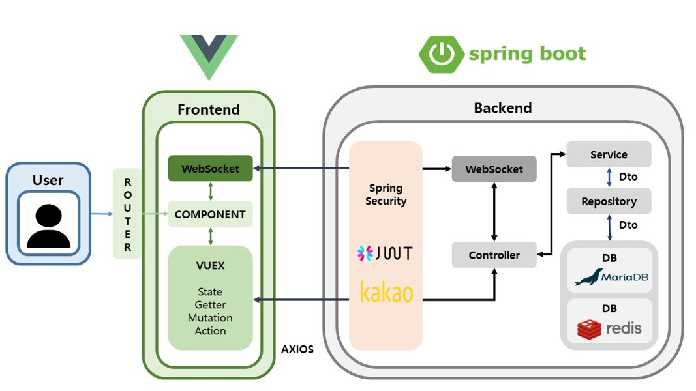
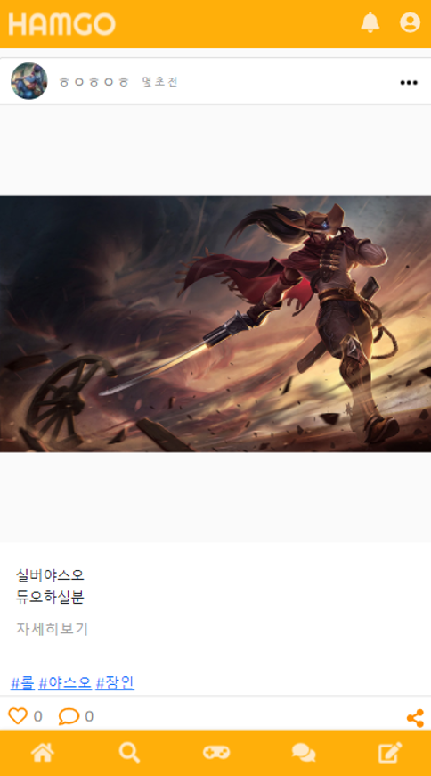
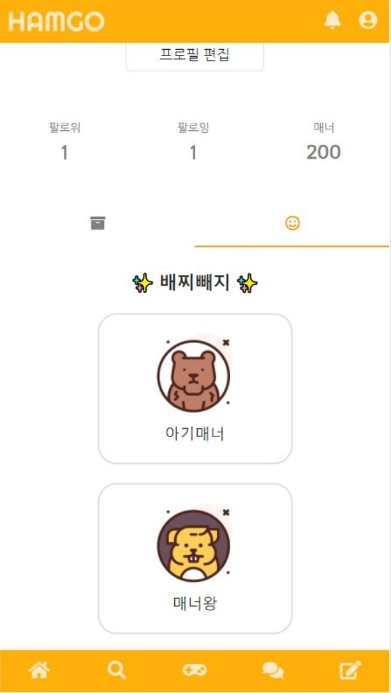
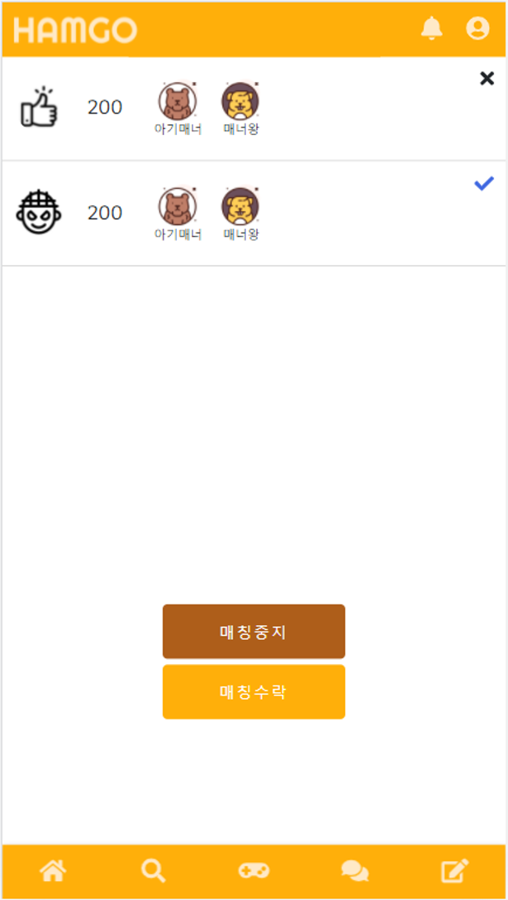
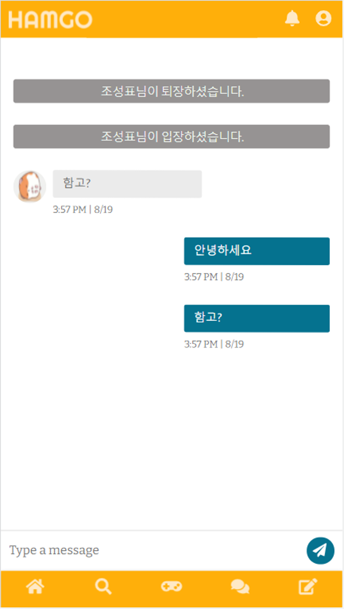

# Game SNS 프로젝트

매칭 서비스를 제공하는 게임 SNS 함고입니다.

개발기간 : 2021.07 ~ 2021.08

참여인원 : 5인 

개발도구:

- Spring Boot
- Spring Securiy
- Maria DB
- Redis
- Web Socket
- JWT
- KAKAO API
- Discord API

## 프로젝트 구조도

## 스크린샷
메인피드  
  
마이페이지  
  
매칭기능  
  
채팅기능  
  
